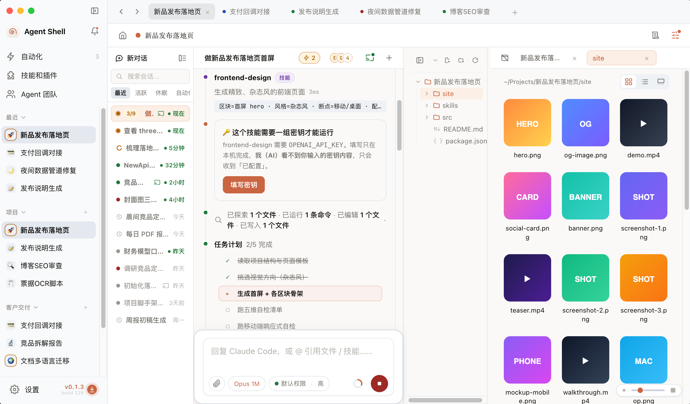

# Agent Shell

一个桌面应用，让你用同一个界面同时驾驭 **Claude Code** 和 **Codex** 两个编码 AI——开多个会话、并行跑任务、随时切换引擎和模型。

**本地优先**：所有项目、会话和密钥都留在你自己的电脑上，不上传任何服务器。

## 为什么用它

- **一个界面，两个引擎**——不用在多个终端和窗口之间来回切，Claude Code 和 Codex 在一处统一管理。
- **多项目、多任务并行**——每个项目一个目录，多个会话同时跑，谁在运行、谁要确认、谁失败了，一眼看清。
- **接你自己的账号或上游**——默认复用你本机已登录的 CLI，也能填自己的 API Key 或中转站；在应用里的设置绝不会影响你在终端 / VS Code 里的用法。
- **数据不出本机**——本地优先，离开应用什么都不留在云端。

## 下载安装

各平台安装包见 [Releases](https://github.com/cookaihq/agent-shell/releases)，历次版本的功能变化见 [更新日志（CHANGELOG）](./CHANGELOG.md)。

> **macOS**：安装包未做苹果签名，首次打开时右键点图标 →「打开」即可绕过系统拦截（只需一次）。

## 主要功能

### 工作区——驱动 AI 干活的地方

- 顶部多项目页签，切换自如；不在看的项目用小圆点提示动态：🔵 等你确认、🟡 运行中、🟢 已完成、🔴 失败。
- 左侧项目栏可按文件夹分组、拖拽排序；鼠标悬停弹出项目卡，能就地改名、看路径和状态。
- 完整的对话时间线：回复正文、思考过程、每一步工具操作（读文件 / 跑命令 / 改代码 / 搜索等）都看得见、可追溯。
- 内置文件浏览与预览，支持文本、图片、视频、音频；一轮任务结束还能自动打开本轮新生成的文件。
- 随时中断正在跑的任务；意外中断后重开会话，已经产出的内容也还在。

### 技能和插件

- 一处统一管理技能、MCP 工具、命令行工具，以及引擎自带的插件。
- 想装新能力？贴个 Git 地址或直接说一句「帮我装个做 PPT 的技能」，交给 AI 自动装好并配置，缺密钥会弹安全窗口让你亲自填（明文不进对话）。
- 内置推荐目录，常用工具一键安装。

### 统一记忆

- 用**一份文件**给两个引擎写全局指令（你的偏好、编码风格、禁忌等），自动同步到 Claude 和 Codex 各自读取的位置，不用分别维护两份。
- 首次使用会把你已有的配置自动合并进来，并先备份原文件。

### 执行模式——接上游、切模型

- 检测本机已安装的引擎并可一键测试连通。
- 默认复用你在终端登录的账号；也能添加自定义上游（官方或中转站），各引擎独立管理模型清单。
- **作用域隔离**：在 Agent Shell 里换上游、换模型，完全不影响你在别处（终端 / VS Code）用 Claude Code 和 Codex。

### 还有

- **密钥管理**——技能和上游所需的密钥统一保管，明文不进界面。
- **任务自动化**——定时或手动触发后台任务，带运行历史。
- **提醒通知**——需要确认 / 完成 / 失败三类事件，支持应用内、声音、系统通知。
- **飞书远程接管**——扫码把会话桥接到飞书，在手机上远程查看和接管。
- **保持后台运行**——关掉应用后，定时任务和飞书远程接管仍可继续。
- **应用更新**——自动检测新版本，提供国内和 GitHub 两个下载源。

## 推荐工具

应用内置了一份常用工具清单（技能 / MCP / 命令行工具），无需手动操作：

- 在「技能和插件 › 发现 · 推荐」里一键安装；
- 首次启动的引导也会带你挑选。

剩下的交给内置 AI 自动装好并配置（缺密钥会弹安全窗口让你填）。

## 已知问题

- **macOS 安装包未签名**：首次打开需右键 →「打开」绕过系统拦截。
- **macOS 26（Tahoe）菜单栏图标可能不显示**：这是当前系统层面的已知问题，**不影响任何功能**——照常从程序坞（Dock）或应用窗口使用即可，后续版本会跟进修复。

## 接下来

- **Agent 团队**——多个 AI 协作完成更大的任务。
- **更多连接器与数据同步**。
- **扩充推荐工具清单**。

## 源代码即将开源

源代码即将开放，敬请期待。当前先提供免费安装包，欢迎在 [Issues](https://github.com/cookaihq/agent-shell/issues) 反馈问题与建议。

## 许可证

[GNU Affero General Public License v3.0](./LICENSE)（AGPL-3.0）。

